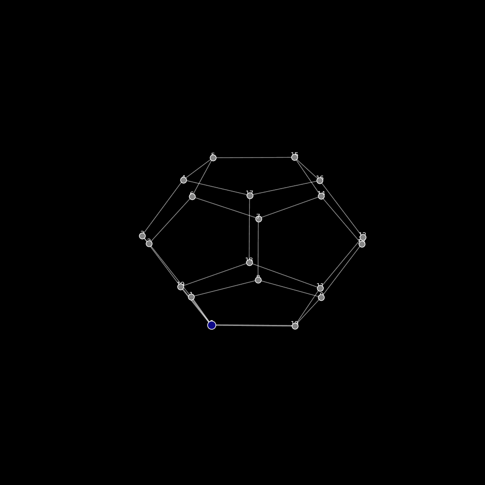

# **Big Data, Grafos y Machine Learning**  

Este repositorio está dedicado a explorar la **Teoría de Grafos y sus aplicaciones en Big Data e Inteligencia Artificial**. Contiene recursos teóricos, implementaciones prácticas y proyectos que demuestran cómo los **grafos** pueden utilizarse para resolver problemas complejos en **análisis de redes, optimización de algoritmos y modelado de estructuras de datos**.  

Los **grafos** son fundamentales en diversos ámbitos como:  

- **Redes sociales:** detección de comunidades, análisis de influencia (ejemplo: TikTok, Twitter).  
- **Recomendaciones de productos:** sistemas de recomendación (Netflix, Amazon).  
- **Ciberseguridad y detección de fraudes:** análisis de transacciones bancarias.  
- **Optimización de rutas:** transporte y logística.  
- **Machine Learning con Grafos:** Graph Neural Networks (GNNs) aplicadas a predicción de enlaces, clasificación de nodos y detección de anomalías.  


---

## **Contenido**  

- [Clases de Big Data](#clases-de-big-data)  
- [Teoría de Grafos](#teoría-de-grafos)  
- [Machine Learning con Grafos](#machine-learning-con-grafos)  
- [Aplicaciones](#aplicaciones)  
- [Ejemplos Visuales](#ejemplos-visuales)  
- [Recursos Adicionales](#recursos-adicionales)  
- [Uso del Repositorio](#uso-del-repositorio)  
- [Colaboración](#colaboración)  
- [Licencia](#licencia)  

---

## **Clases de Big Data**  

- `BIG_DATA_Clase_Cuarta.ipynb`: Introducción al uso de la teoría de grafos en redes sociales, con ejemplos prácticos sobre **detección de comunidades**.  
- `BIG_DATA_Digrafos_y_Redes_Clase.ipynb`: **Dígrafos** y análisis de redes orientadas en el contexto de Big Data.  

Ejemplo: **Detección de comunidades en redes sociales con NetworkX**  

```python
import networkx as nx
import matplotlib.pyplot as plt
from networkx.algorithms import community

G = nx.karate_club_graph()
communities = community.greedy_modularity_communities(G)

colors = []
for node in G.nodes():
    for i, comm in enumerate(communities):
        if node in comm:
            colors.append(i)

nx.draw(G, with_labels=True, node_color=colors, cmap=plt.cm.rainbow)
plt.show()
```

---

## **Teoría de Grafos**  

- `Graph_Convolution_Network.ipynb`: Implementación y estudio de **Graph Convolutional Networks (GCNs)**.  
- `Hipergrafo_y_ciclo_hamiltoniano.ipynb`: Implementación de **ciclo hamiltoniano en un hipergrafo**.  

Ejemplo: **Ciclo Hamiltoniano en un grafo completo**  

```python
import networkx as nx

G = nx.complete_graph(5)
hamiltonian_cycle = list(nx.find_cycle(G, orientation="ignore"))

print("Ciclo Hamiltoniano:", hamiltonian_cycle)
```

---

## **Machine Learning con Grafos**  

- `Prediccion_de_Enlaces.ipynb`: **Predicción de enlaces** en redes sociales usando aprendizaje automático.  
- `Graph_Convolution_Network.ipynb`: Implementación de **Graph Neural Networks (GNNs) con PyTorch Geometric**.  

Ejemplo: **Graph Convolutional Network (GCN) con PyTorch Geometric**  

```python
import torch
import torch.nn.functional as F
from torch_geometric.nn import GCNConv
from torch_geometric.data import Data

edge_index = torch.tensor([[0, 1, 1, 2], [1, 0, 2, 1]], dtype=torch.long)
x = torch.tensor([[1], [2], [3]], dtype=torch.float)

data = Data(x=x, edge_index=edge_index)

class GCN(torch.nn.Module):
    def __init__(self):
        super().__init__()
        self.conv1 = GCNConv(1, 16)
        self.conv2 = GCNConv(16, 2)

    def forward(self, data):
        x, edge_index = data.x, data.edge_index
        x = self.conv1(x, edge_index).relu()
        x = self.conv2(x, edge_index)
        return F.log_softmax(x, dim=1)

model = GCN()
output = model(data)
print(output)
```

Ejemplo: **Modelo de recomendación en TikTok con GNNs**  

```python
import torch
from torch_geometric.nn import GraphConv
from torch_geometric.data import Data

edge_index = torch.tensor([[0, 1, 2], [1, 2, 0]], dtype=torch.long)  
x = torch.tensor([[1, 0], [0, 1], [1, 1]], dtype=torch.float)  

data = Data(x=x, edge_index=edge_index)

class TikTokGNN(torch.nn.Module):
    def __init__(self):
        super().__init__()
        self.conv1 = GraphConv(2, 16)
        self.conv2 = GraphConv(16, 2)

    def forward(self, data):
        x, edge_index = data.x, data.edge_index
        x = self.conv1(x, edge_index).relu()
        x = self.conv2(x, edge_index)
        return x

model = TikTokGNN()
output = model(data)
print(output)
```

---

## **Ejemplos Visuales**  

### **Animación de Dodecaedro y BFS**  

Esta animación muestra el recorrido en un **dodecaedro** usando **BFS (Búsqueda en Anchura)**.  

  

---

## **Recursos Adicionales**  

- [Introduction to Graph Theory - Robin J. Wilson](https://www.maths.ed.ac.uk/~v1ranick/papers/wilsongraph.pdf)
- [Introductory Graph Theory  por Jacques Verstraete](https://cseweb.ucsd.edu/~dakane/Math154/154-textbook.pdf)  
- [Graph Neural Networks: A Review](https://arxiv.org/abs/1901.00596)  
- [NetworkX Documentation](https://networkx.org/)  

---

## **Uso del Repositorio**  

Para clonar el repositorio y ejecutar los notebooks:  

```bash
git clone https://github.com/sgevatschnaider/Grafos.git
cd Grafos
jupyter notebook
```

Abre el notebook de tu interés y ejecuta los ejemplos interactivos.  

# Notebooks Interactivos  
Puedes abrir y ejecutar los notebooks en Google Colab directamente desde aquí:  

---

## 📊 **Introducción a la materia**  


| 📄 **Recurso** | 📥 **Acceso** |
|--------------|------------|
| **Introducción al BIG DATA** | [](https://github.com/sgevatschnaider/GraphAI-Data-Science-ML/blob/ba97ebadab45f05b0b5b3b4b5ca2fc7156a24691/BIG%20DATA%20INTRODUCCIÓN.pdf) |
| **Cómo TikTok Sabe lo que Quieres Ver** | [](https://sgevatschnaider.github.io/GraphAI-Data-Science-ML/blog/tiktok-algoritmo.html) |
| **Introducción a Big Data en Google Colab** | [](https://colab.research.google.com/github/sgevatschnaider/GraphAI-Data-Science-ML/blob/main/notebooks/Clase_Introduccion_BigData_2025.ipynb) |
| **Sistemas de Recomendación y TikTok** | [](https://colab.research.google.com/drive/1eqcIUhjwrKRj4_4rFv_tg7vRYkxkjuUE) |
| **Evolución y Funcionamiento de los Sistemas de Recomendación** | [](https://github.com/sgevatschnaider/GraphAI-Data-Science-ML/blob/35919d0c04d0f2e447590877c33420003bfcfcc6/Evolución%20y%20Funcionamiento%20de%20los%20Sistemas%20de%20Recomendación.pdf) |
| **Preguntas Big Data** | [](https://github.com/sgevatschnaider/GraphAI-Data-Science-ML/blob/9b93a3f622c3d4a544fe593d8ede12f4f1de2f14/Preguntas_Big_Data.pdf) |
| **Preguntas y Respuestas sobre Sistemas de Recomendación** | [](https://github.com/sgevatschnaider/GraphAI-Data-Science-ML/blob/ed7eb3145a0f91d14dd5e450886e9f876d626ab2/Preguntas%20y%20Respuestas%20sobre%20Sistemas%20de%20Recomendaci%C3%B3n.pdf) |

---
## 📝 Clase 2

| 📄 **Recurso** | 📥 **Acceso** |
|---------------|---------------|
| **Big data clase 2025** | [](https://github.com/sgevatschnaider/GraphAI-Data-Science-ML/blob/865757a0e290dd3a8692fbc8db8734a24da10964/Big%20data%20clase%202025.pdf) |
| **Sharding y el Teorema CAP en Sistemas Distribuidos** | [](https://github.com/sgevatschnaider/GraphAI-Data-Science-ML/blob/865757a0e290dd3a8692fbc8db8734a24da10964/notebooks/%20Clase_2_Sharding_y_el_Teorema_CAP_en_Sistemas_Distribuidos_pynb.ipynb) |
| **La Computación en el Borde y su Aplicación en IoT Drones Inteligentes** | [](https://github.com/sgevatschnaider/GraphAI-Data-Science-ML/blob/6af211740e78c4d4ea60b5bad0711c03403c65f5/notebooks/Clase_II_La_Computaci%C3%B3n_en_el_Borde_y_su_Aplicaci%C3%B3n_en_IoT_Drones_Inteligentes.ipynb) |
| **El automóvil como código: China, IA y la nueva arquitectura del poder automotriz** | [](https://github.com/sgevatschnaider/sgevatschnaider.github.io/blob/1a4a1c11ae45c541e692ddd3850f5fbc71c4c34a/China_Chips_y_Autos_Inteligentes.md) |

---
## 📝 Clase 3

| 📄 **Recurso** | 📥 **Acceso** |
|---------------|---------------|
| **BIG DATA - Clase Tercera: Grafos, Introducción, Teoría y Práctica** | [](https://github.com/sgevatschnaider/GraphAI-Data-Science-ML/blob/39263860674a57ce49e8891a0b4401d288d64778/notebooks/%20BIG_DATA__Clase_Tercera__Grafos_Introducci%C3%B3n_Teor%C3%ADa_y_Pr%C3%A1ctica_.ipynb) |
| **Cuestionario Introducción Teoría de los Grafos** | [](https://github.com/sgevatschnaider/GraphAI-Data-Science-ML/blob/246c0d6d7e52493966382a0f60c4f65f358b5868/notebooks/Cuestionario_Clase_Tercera.ipynb) |


## 📝 Clase 4

| 📄 **Recurso** | 📥 **Acceso** |
| -------------- | ------------- |
| **BIG DATA - Clase Cuarta: Grafos dirigidos y cuestionario** | [](https://github.com/sgevatschnaider/GraphAI-Data-Science-ML/blob/a24aad0eb97f24e7ea65edf886ecf2e11e47eb77/notebooks/BiG_DATA_GRAFOS_DIRIGIDOS_y_cuestionario.ipynb) [](https://colab.research.google.com/drive/1V0ODsPGihaMgLFV-JpBGZDEhPmynbeVk?usp=sharing) |


---
## 📝 Clase 5

| 📄 **Recurso** | 📥 **Acceso** |
| -------------- | ------------- |
| **BIG DATA - Clase Cuarta: Random surfer** | [](https://github.com/sgevatschnaider/GraphAI-Data-Science-ML/blob/fd2684f3294d47df41f226ea369175437801e46f/notebooks/random_surfer.ipynb) [](https://colab.research.google.com/drive/1rgDj2ySwsnqKTGMD6azdeRMhtGsx_ri-?usp=sharing) |


---

## 📝 Clase 6

| 📄 Recurso                                                                       | 📥 Acceso                                                                                                                                                                                                                                                                                             |
| --------------------------------------------------------------------------------- | ------------------------------------------------------------------------------------------------------------------------------------------------------------------------------------------------------------------------------------------------------------------------------------------------------ |
| **Autómatas Celulares: Unidimensionales, Bidimensionales y Máquina de Turing** | [](https://github.com/sgevatschnaider/GraphAI-Data-Science-ML/blob/a59bee63ffa0f5452fc13aa79136e458ef9262e5/notebooks/Aut%C3%B3matas_celulares_unidimensionales%2C_bidimensional_y_maquina_de_turing.ipynb) [](https://colab.research.google.com/github/sgevatschnaider/GraphAI-Data-Science-ML/blob/a59bee63ffa0f5452fc13aa79136e458ef9262e5/notebooks/Aut%C3%B3matas_celulares_unidimensionales%2C_bidimensional_y_maquina_de_turing.ipynb) |

## 📝 Clase 7

| 📄 Recurso | 📥 Acceso |
| ---------- | -------- |
| **Ejercicios de Autómatas Celulares** | [](https://github.com/sgevatschnaider/GraphAI-Data-Science-ML/blob/84fa72855bfe6837354a5a0354fc035cd6b26fcf/notebooks/Automatas_celulares_ejercicios_github.ipynb) [](https://colab.research.google.com/github/sgevatschnaider/GraphAI-Data-Science-ML/blob/84fa72855bfe6837354a5a0354fc035cd6b26fcf/notebooks/Automatas_celulares_ejercicios_github.ipynb) |

---

## 📝 Clase 8

| 📄 Recurso | 📥 Acceso |
| ---------- | -------- |
| **Ejercicios de Autómatas Celulares** | [](https://github.com/sgevatschnaider/GraphAI-Data-Science-ML/blob/84fa72855bfe6837354a5a0354fc035cd6b26fcf/notebooks/Automatas_celulares_ejercicios_github.ipynb) [](https://colab.research.google.com/github/sgevatschnaider/GraphAI-Data-Science-ML/blob/84fa72855bfe6837354a5a0354fc035cd6b26fcf/notebooks/Automatas_celulares_ejercicios_github.ipynb) |

## 📝 Clase 9

| 📄 Recurso | 📥 Acceso |
| ---------- | -------- |
| **Camino y Ciclo Hamiltoniano** | [](https://github.com/sgevatschnaider/GraphAI-Data-Science-ML/blob/78624a61be52f4180f30ca5691e5196f2ae3fde9/notebooks/Camino%2C_ciclo_hamiltoneano.ipynb) [](https://colab.research.google.com/github/sgevatschnaider/GraphAI-Data-Science-ML/blob/78624a61be52f4180f30ca5691e5196f2ae3fde9/notebooks/Camino%2C_ciclo_hamiltoneano.ipynb) |

## 📝 Clase 10

| 📄 Recurso | 📥 Acceso |
| ---------- | -------- |
| **Método Metaheurístico: Algoritmo Genético y el Problema del Viajante** | [](https://github.com/sgevatschnaider/GraphAI-Data-Science-ML/blob/1b858e3dc01de2e703f2dd72f770c4d010ea78aa/notebooks/M%C3%A9todo_metaeur%C3%ADstico_Algoritmo_gen%C3%A9tico_y_el_problema_del_viajante_ipynb.ipynb) [](https://colab.research.google.com/github/sgevatschnaider/GraphAI-Data-Science-ML/blob/1b858e3dc01de2e703f2dd72f770c4d010ea78aa/notebooks/M%C3%A9todo_metaeur%C3%ADstico_Algoritmo_gen%C3%A9tico_y_el_problema_del_viajante_ipynb.ipynb) |


## 📊 Modelos Visuales: *Darwin Gödel Machine*

> Representaciones visuales e interactivas sobre conceptos relacionados con aprendizaje, lógica y teoría evolutiva aplicada al modelado de información y toma de decisiones.

<details>
<summary><strong>Resumen:</strong> <em>(haz clic para expandir/colapsar)</em></summary>
<p>Este conjunto de archivos HTML ofrece visualizaciones interactivas de los conceptos fundamentales de la Darwin Gödel Machine. Exploran la arquitectura del agente, el ciclo evolutivo de auto-mejora y los diagramas clave presentados en el paper, permitiendo una comprensión más profunda y tangible de la teoría.</p>
</details>

|  recurso | Acceso |
|--------------------|--------------------------------------------------------------------------------------------------------------------------------------------------|
| **DGM11** | [🔍 Ver Visualización](https://github.com/sgevatschnaider/GraphAI-Data-Science-ML/blob/57cd6a43d37590b6f96d5e314c2f4a94c61730f2/notebooks/DGM11.html) |
| **Diagrama Paper** | [📘 Ver Visualización](https://github.com/sgevatschnaider/GraphAI-Data-Science-ML/blob/57cd6a43d37590b6f96d5e314c2f4a94c61730f2/notebooks/diagrama%20paper.html) |
| **Diagram 4** | [📘 Ver Visualización](https://github.com/sgevatschnaider/GraphAI-Data-Science-ML/blob/451d5ea2656a472eff85214c35288c9f9a90c6be/notebooks/diagram4.html) |

📝 *Estos archivos HTML están diseñados para visualización estática y no requieren entorno de ejecución (como Colab o Jupyter).*

---

## 🎞️ Animaciones y Gráficos Dinámicos

<details>
<summary><strong>Resumen:</strong> <em>(haz clic para expandir/colapsar)</em></summary>
<p>Esta sección contiene animaciones GIF que muestran la simulación de la Darwin Gödel Machine en acción. Se puede observar el proceso evolutivo de los agentes en tiempo real, incluyendo la generación de nuevos nodos (agentes), la formación de linajes y la dinámica de un "archivo evolutivo" en crecimiento.</p>
</details>

| Nombre | Visualización |
|----------|---------------|
| **DGM2** |  |
## Acceso al Material Educativo

**Este repositorio es solo de lectura para los estudiantes.**  

Los alumnos pueden **descargar y utilizar** el material, pero **no pueden editarlo**.  
Si tienes dudas o sugerencias, abre un **Issue** en GitHub. 

**Para descargar los archivos, usa los enlaces disponibles en la sección de contenidos.**


## **Licencia**  

Este proyecto está bajo la licencia **MIT**. Consulta el archivo LICENSE para más detalles.  

